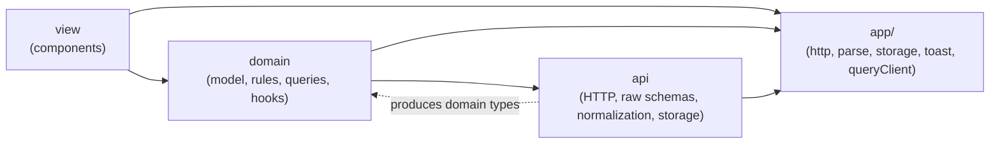
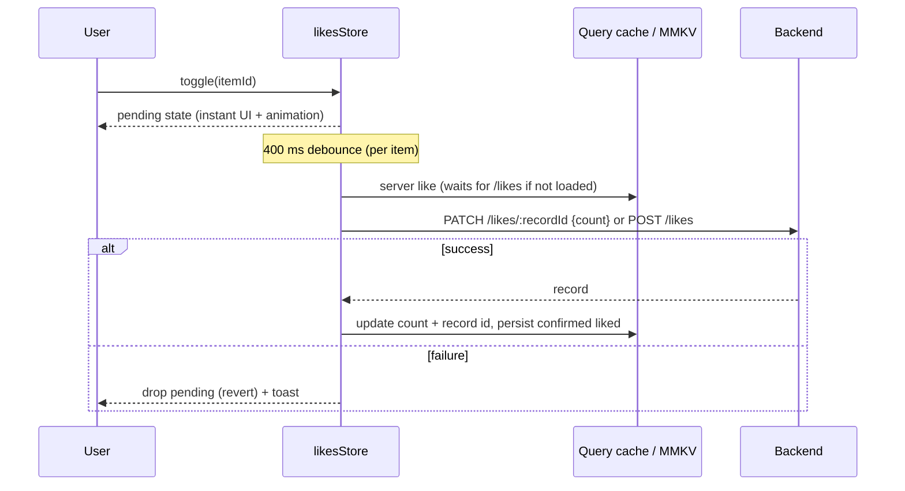

# Project tour

A React Native (Expo SDK 55) app that aggregates content from three partner providers into a
single scrollable feed with three differently styled sections, plus a persisted, optimistic
like feature with a Rive animation.

This document walks through the architecture, then each feature and how it works.

---

## 1. At a glance

| | |
|---|---|
| **Runtime** | Expo SDK 55, React Native 0.83 (new architecture), React 19, Hermes |
| **Build** | Expo development build (`npx expo run:ios`) — native modules rule out Expo Go |
| **Server state** | TanStack Query v5 (queries, infinite queries, cache as the app's server-state store) |
| **Local persistence** | `react-native-mmkv` v4 (synchronous key-value storage) |
| **Animation** | `@rive-app/react-native` (Nitro-based runtime, view-model data binding) |
| **Rendering perf** | React Compiler (automatic memoization, no manual `memo`/`useMemo`/`useCallback`) |
| **Backend** | `json-server` over `db.json` (`npm run server`, port 3000) |

### Running it

```bash
npm install
npm run server          # json-server on http://localhost:3000
npx expo run:ios        # first time / after native dependency changes (needs Xcode 26.2+)
npm start               # afterwards, to serve JS to the installed dev build
```

> `json-server` writes every like back into `db.json`. Don't commit those changes.

---

## 2. Architecture

### Folder layout

```
src/
  app/                      infrastructure shared by all features
    App.tsx                 root: providers, like-count prefetch, toast host
    config.ts               backend base URL
    http.ts                 fetchJson / sendJson
    parse.ts                runtime guards + normalizeAll (used by every normalizer)
    storage.ts              MMKV wrapper (readJson / writeJson)
    queryClient.ts          app-wide QueryClient (shared with non-React code)
    toast/                  toastStore (tiny emitter) + ToastHost (animated view)
  features/
    feed/
      api/                  provider schemas, fetching, normalization, pagination rounds
      domain/               FeedItem model, section building, queries, useFeed
      view/                 FeedScreen, row model, cards, carousels
    like/
      api/                  likes REST calls + normalizer, MMKV persistence
      domain/               Like model, sync engine (likesStore), queries, useLike
      view/                 LikeButton (Rive), LikeAnimationProvider
fixtures/                   reference copies of provider data (not used by the app)
plugins/                    Expo config plugin(s)
rive-doc/                   design team's Rive file + spec
assets/animations/          bundled .riv used at runtime
```

### Layers and dependency rule

Each feature is split into three layers:



- **api** is the boundary with the outside world. It knows raw provider schemas, endpoints,
  json-server quirks and MMKV keys. It returns **domain types only** — nothing raw leaks upward.
- **domain** holds the internal model (`FeedItem`, `LikeCount`), the business rules (how
  sections are built, how likes sync), the TanStack Query definitions and the hooks the view
  consumes (`useFeed`, `useLike`).
- **view** renders. It never fetches or transforms data; it maps domain state to components.
- **app** is cross-cutting infrastructure every feature may use.

One cross-feature dependency exists on purpose: feed cards render `like/view/LikeButton`.

---

## 3. Feed feature

### 3.1 The problem: three providers, three schemas

The three endpoints describe the same concept with different shapes:

| Concept | Provider A | Provider B | Provider C |
|---|---|---|---|
| id | `id` (`"a-1"`) | `id` (`"b-100"`, **not unique**) | `id` (bare number) |
| title | `title` (can be `null`) | `headline` | `Title` (capital T) |
| image | `image` | `media.url` (`media` can be `null`) | `picture_url` |
| date | ISO datetime | Unix **seconds** `ts` | `YYYY-MM-DD` (can be `"yesterday"`) |
| link | `ctaUrl` | `link` | `action_url` |
| author | `author` | `source` | `byline` |
| extra | `tags` | `media.alt` | `section_hint` |

### 3.2 Normalization (api layer)

Every provider module (`feed/api/providerA.ts`, `providerB.ts`, `providerC.ts`) owns:

1. its **raw type** (documenting known quirks),
2. a **normalizer** `normalizeProviderXItem(raw): FeedItem | null`,
3. a `ContentProvider` implementation with `fetchPage({ page, perPage, signal })`.

All normalizers produce the same internal model (`feed/domain/FeedItem.ts`):

```ts
type FeedItem = {
  id: string;              // globally unique: "a-1", "b-100", "c-3" (matches the likes resource)
  provider: ProviderId;
  title: string;
  imageUrl: string | null;
  imageAlt: string | null;
  publishedAt: Date;       // required
  url: string;
  author: string | null;
  tags: string[];
  sectionHint: "featured" | "browse" | "discover" | null;
};
```

Rules applied at the boundary (runtime guards from `app/parse.ts`, since the backend is not trusted):

- **Required:** id, title, link and a valid date. Items missing any of them are **dropped** as
  malformed (logged in dev): `a-bad-1` (null title), `c-9999` (`"yesterday"`), impossible
  dates such as `2026-02-31`.
- **Optional fields degrade gracefully:** missing image → placeholder, missing alt → none.
- **Dates:** B's seconds are converted; C's calendar dates are parsed as *local* midnight so
  they don't display a day early west of UTC.
- **Ids:** C's numeric ids are namespaced to `c-<id>` so they're unique and match the likes
  resource. Duplicate ids (e.g. B's repeated `b-100`) are removed when merging.

### 3.3 Pagination: rounds (api + domain)

The Browse section loads more as the user scrolls. Pagination is modelled as **rounds**
(`feed/api/fetchFeedRound.ts`):

- A round fetches the **next page of every provider that still has one**, in parallel
  (`Promise.allSettled`).
- Each provider has its own cursor (`ProviderCursors`); a provider with no next page drops out.
- A provider that **fails keeps its cursor**, so its page is retried on the next round; the round
  only fails if every provider in it failed.
- Rounds are appended in order, and items keep their fetch order, so **loading more never
  reorders rows already on screen** (no flicker).

In the domain layer, `feedRoundsQuery` (`feed/domain/feedQueries.ts`) is a TanStack
`infiniteQuery` where each page is one round and the page param is the cursor map.

Featured items come from a separate small query, `providerCFeaturedQuery`, which asks provider C
for its featured items server-side (`?section_hint=featured`) — they are sparse and rarely
appear in the first pages.

### 3.4 Building the sections (domain)

`buildFeedSections` (`feed/domain/buildFeed.ts`) turns featured items + rounds into:

| Section | Content |
|---|---|
| **Featured** | Items flagged `section_hint: "featured"` (provider C), up to 5 |
| **Browse** | Every other item, in fetch order (C's `browse`/`discover` hints are ignored) |
| **Discover** | Browse items **grouped by author**; an author needs ≥ 2 items to get a group |

An item can appear both in Browse and in its author's Discover group. Author groups are ordered
by *when they qualify* (their 2nd item is seen), so a group that qualifies after more pages load
is appended rather than inserted ahead of groups already on screen.

### 3.5 `useFeed` (domain hook)

`useFeed` combines both queries and exposes everything the screen needs:

- `sections`, `isLoading` (waits for both queries to settle so Featured doesn't pop in later),
- `loadMore` (guarded: no page load during a refresh or another page load),
- `refresh` (pull-to-refresh trims to the first round, then refetches — pagination restarts),
- `retry` (retries a failed next page, or refetches after a failed first load/refresh),
- `isLoadingMore`, `loadFailed`, `hasMore`, `failedProviders` (partial failures).

### 3.6 Rendering (view)

The whole screen is **one virtualized `FlatList`** of heterogeneous rows, so everything scrolls
as a single surface. `buildFeedRows` (`feed/view/feedRows.ts`) maps sections to a row model:

```ts
type FeedRow =
  | { type: "header";   title: string }
  | { type: "featured"; items: FeedItem[] }   // one horizontal carousel
  | { type: "browse";   item: FeedItem }      // one compact row per item
  | { type: "discover"; items: FeedItem[] };  // one author carousel
```

Layout of the list:

```
Featured            ← header
[ hero carousel ]   ← FeaturedCarousel (paged, with dot indicator)
Browse              ← header
row 1 … row 10      ← BrowseRow
Discover more : <author A>   ← header
[ author carousel ] ← DiscoverCarousel
row 11 … row 20
Discover more : <author B>
[ author carousel ]
…                   ← new pages append Browse rows at the bottom
```

A Discover carousel is slotted after every block of 10 Browse items while author groups remain,
so Browse can keep growing at the end of the list. Each row type maps to one component:

| Component | Look |
|---|---|
| `FeaturedCarousel` + `FeaturedCard` | Full-width, image-forward hero cards, snap paging, dot indicator |
| `BrowseRow` | Dense text-forward row: thumbnail left, text, like button right |
| `DiscoverCarousel` | Horizontal carousel of medium cards, like button bottom-right |
| `ProviderLabel` | Small uppercase provider tag shared by all cards |

The footer reflects pagination state: spinner while loading more, "Tap to retry" on failure,
"You're all caught up." when every provider is exhausted.

---

## 4. Like feature

### 4.1 Backend contract

`GET /likes` returns records `{ id, itemId, count }`. Writes are plain REST: `PATCH /likes/:id`
sets the count, `POST /likes` creates a record. Two facts shape the design:

- **State-based, no atomic increment** — the client computes and writes the absolute count.
- **No per-user data** — "liked by me" only exists on the device.
- json-server **ignores the id sent on POST** and generates one, so the record id is tracked
  separately from the item id (`LikeCount.recordId`).

### 4.2 State model (domain)

The UI behaves as a **toggle with a count** (like = +1, unlike = −1). Per item, three sources
are merged:

| Source | Where | Persisted |
|---|---|---|
| Server count + record id | `likeCountsQuery` (TanStack Query cache) | MMKV `likes.v2.counts` |
| Confirmed "liked by me" | `likesStore` | MMKV `likes.v1.liked` |
| Pending taps | `likesStore` (in memory) | no |

Displayed state: `isLiked = pending ?? confirmedLiked`,
`count = serverCount + (isLiked − confirmedLiked)`.

Keeping pending taps separate means a refetch never clobbers an optimistic tap, and a rollback
is simply dropping the pending entry.

### 4.3 The sync engine (`like/domain/likesStore.ts`)

`createLikesStore(deps)` is a framework-free engine with injected dependencies (API, cache,
storage, error callback), wired to the real ones in `like/domain/likes.ts`.



- **Instant:** the tap updates the pending state and notifies subscribers immediately.
- **Final-state writes:** writes are debounced (400 ms) and serialized per item — at most one
  request in flight, and only the latest desired state is sent. Like → unlike inside the debounce
  sends nothing.
- **Taps during a request:** the engine re-checks when the request settles and sends a follow-up
  if the desired state changed.
- **Failure:** pending state is dropped (UI and animation revert) and a toast is shown.
- **Only confirmed state is persisted:** a like that never reached the server isn't resurrected
  on the next launch.
- **No duplicates:** writes use the known record ids (cached or fetched). When nothing is cached
  yet (first launch), the engine waits for `/likes` (`ensureQueryData`) before writing, so it
  never POSTs a record that already exists.

### 4.4 Startup and persistence

- `likeCountsQuery` uses MMKV as `initialData`, so counts render immediately on cold start —
  no blink to zero.
- The seed is marked as infinitely old (`initialDataUpdatedAt: 0`), so it's refetched on launch
  and server values replace cached ones (reconciliation). `App.tsx` prefetches it in parallel
  with the feed.
- A 5-minute `staleTime` prevents a refetch every time a like button mounts while scrolling.

### 4.5 `useLike` and the button (view)

`useLike(itemId)` returns `{ count, isLiked, toggle }` by reading the query cache (with `select`)
and the store (`useSyncExternalStore`). Every component showing the same item reads the same
state, so liking an item in Browse updates it in Discover and Featured too.

`LikeButton` (`like/view/LikeButton.tsx`):

- A `Pressable` handles taps; the Rive view underneath is non-interactive (`pointerEvents="none"`)
  so Rive's own tap-toggle can never desync from our state.
- The optimistic `isLiked` is bound to the Rive view model property `MainVM.isActive`
  (`useViewModelInstance` + `useRiveBoolean`), so the **state drives the animation** — including
  rolling it back on failure.
- After setting the property, it calls `playIfNeeded()`: the native view pauses once the state
  machine settles, and a view-model change alone doesn't wake it.
- `LikeAnimationProvider` loads the `.riv` file **once** for the whole app and shares it via
  context; a text heart is shown as fallback while it loads.

Known limitation: the Rive file only reaches its "liked" state through the tap animation (with
sound), so an already-liked item plays it when it mounts. Fixing this needs a design change in
the file (instant `isActive` transitions + a separate `tap` trigger for the animation).

---

## 5. Shared infrastructure (`src/app`)

| Module | Role |
|---|---|
| `http.ts` | `fetchJson` (GET with abort signal) and `sendJson` (POST/PATCH); non-2xx → throws |
| `parse.ts` | `asId`, `asNonEmptyString`, `asDate`, `asStringArray`, `normalizeAll` (drops + logs malformed items) |
| `storage.ts` | Single MMKV instance, JSON helpers; corrupted entries are discarded instead of crashing |
| `queryClient.ts` | One `QueryClient`, used by React and by the likes engine |
| `toast/` | `showToast(message)` emitter + `ToastHost` (fade/slide, auto-dismiss ~2.5 s, polite live region) |

---

## 6. Build and tooling notes

- **React Compiler** is enabled in `app.json` (`experiments.reactCompiler`). All components and
  hooks compile; there is no manual `memo`/`useMemo`/`useCallback` in the codebase.
- **Metro** bundles `.riv` files as assets (`metro.config.js`).
- **Config plugin** `plugins/withPodsMinDeploymentTarget.js` raises pods declaring iOS < 15.1
  (RiveRuntime's privacy bundle) so Xcode 27 builds; it survives `expo prebuild --clean`.
- `ios/` is generated (`expo prebuild`) and git-ignored.

---

## 7. Status and known limitations

| Area | Status |
|---|---|
| Part 1 — Feed (normalization, sections, pagination, refresh, partial failures) | Done |
| Part 2 — Likes (optimistic, persisted, reconciled, animated, error toast) | Done |
| Part 3 — Tracking event on feed mount | Not implemented yet |

- **Concurrent likes from other users can be lost:** the backend only accepts absolute counts.
- **Rive mount animation** for already-liked items (see 4.5).
- **Leftover Discover groups:** an author group only shows when enough Browse items exist to
  reach its slot.
- **No automated test suite:** logic was verified with scripted checks (sync engine, rounds,
  normalizers) during development.
