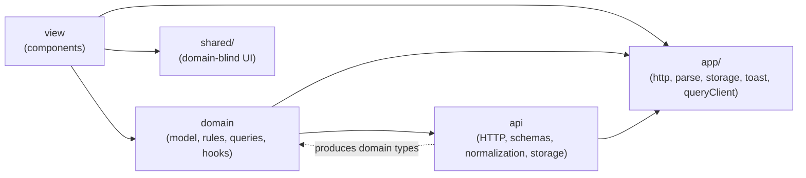
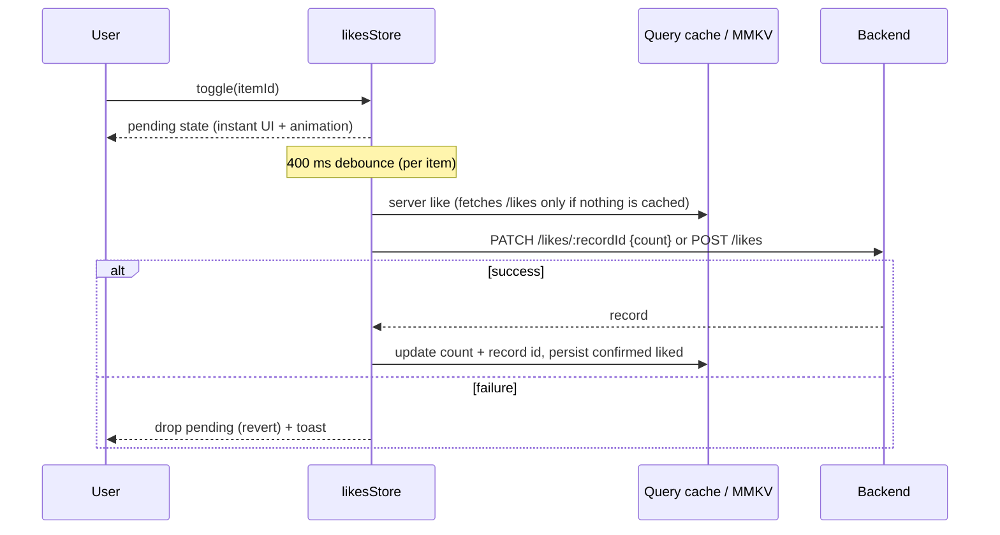

# Project tour

A React Native (Expo SDK 55) app that aggregates content from three partner providers into a
single scrollable feed with three differently styled sections, plus a persisted, optimistic
like feature with a Rive animation.

This document walks through the architecture, then each feature and how it works.
Two deeper dives complement it:

- [`FEED_PROVIDERS.md`](./FEED_PROVIDERS.md): the feed provider pipeline end to end (schemas,
  rounds and cursors, sections, failure handling).
- [`FEED_QUERIES.md`](./FEED_QUERIES.md): how the featured query and the feed query live side
  by side (lifecycle, refresh, retry, failures).

---

## 1. At a glance

| | |
|---|---|
| **Runtime** | Expo SDK 55, React Native 0.83 (new architecture), React 19, Hermes |
| **Build** | Expo development build (`npx expo run:ios`) — native modules rule out Expo Go |
| **Server state** | TanStack Query v5 (queries, infinite queries, cache as the app's server-state store) |
| **Validation** | Zod 4 schemas at every trust boundary (provider payloads, like records, page envelopes) |
| **Local persistence** | `react-native-mmkv` v4 (synchronous key-value storage) |
| **Animation** | `@rive-app/react-native` (Nitro-based runtime, view-model data binding) |
| **Rendering perf** | React Compiler (automatic memoization, no manual `memo`/`useMemo`/`useCallback`) |
| **Backend** | `json-server` over `db.json` (`npm run server`, port 3000) |

### Running it

```bash
npm install
npm run server          # json-server on http://localhost:3000
npx expo run:ios        # first time / after native dependency changes (needs Xcode 26.2+)
npm start               # afterwards, to serve JS to the installed dev build
```

> `json-server` writes every like back into `db.json`. Don't commit those changes.

---

## 2. Architecture

### Folder layout

```
src/
  app/                        infrastructure shared by all features
    App.tsx                   root: providers, like-count prefetch, toast host
    config.ts                 backend base URL
    http.ts                   fetchJson / sendJson over one request() with a 10 s timeout
    parse.ts                  reusable zod field schemas + parseEach (drops malformed items)
    storage.ts                MMKV wrapper (readJson / writeJson)
    queryClient.ts            app-wide QueryClient (retry: 1)
    logger.ts                 info / warn / error, console transport
    session.ts                session id (per app launch) + id helper
    toast/                    toastStore (tiny emitter) + ToastHost (animated view)
  shared/                     domain-blind UI components
    SnapCarousel.tsx          horizontal snapping carousel used by Featured and Discover
  features/
    feed/
      api/                    provider schemas, page fetching, pagination rounds (index.ts = public entry)
      domain/                 FeedItem model, feedSections, feedQueries, useFeed
      view/                   FeedScreen, row model (feedRows), ProviderLabel, feed_presented tracking
        browse/               BrowseRow
        discover/             DiscoverCarousel (+ DiscoverCard)
        featured/             FeaturedCarousel, FeaturedCard
    like/
      api/                    likes REST calls + record schema, MMKV persistence
      domain/                 ServerLike model, sync engine (likesStore), queries, useLike
      view/                   LikeButton (Rive), LikeAnimationProvider
fixtures/                     reference copies of provider data (not used by the app)
plugins/                      Expo config plugin(s)
rive-doc/                     design team's Rive file + spec
assets/animations/            bundled .riv used at runtime
```

### Layers and dependency rule

Each feature is split into three layers:



- **api** is the boundary with the outside world. It knows raw provider schemas, endpoints,
  json-server quirks and MMKV keys. It returns **domain types only** — nothing raw leaks upward.
  The feed's api exposes itself through `feed/api/index.ts`; the domain imports only from there.
- **domain** holds the internal model (`FeedItem`, `ServerLike`), the business rules (how
  sections are built, how likes sync), the TanStack Query definitions and the hooks the view
  consumes (`useFeed`, `useLike`).
- **view** renders. It never fetches or transforms data; it maps domain state to components.
- **shared** holds UI building blocks that know nothing about the domain.
- **app** is cross-cutting infrastructure every feature may use.

One cross-feature dependency exists on purpose: feed cards render `like/view/LikeButton`.

---

## 3. Feed feature

### 3.1 The problem: three providers, three schemas

The three endpoints describe the same concept with different shapes:

| Concept | Provider A | Provider B | Provider C |
|---|---|---|---|
| id | `id` (`"a-1"`) | `id` (`"b-100"`, **not unique**) | `id` (bare number) |
| title | `title` (can be `null`) | `headline` | `Title` (capital T) |
| image | `image` | `media.url` (`media` can be `null`) | `picture_url` |
| date | ISO datetime with offset | Unix **seconds** `ts` | `YYYY-MM-DD` (can be `"yesterday"`) |
| link | `ctaUrl` | `link` | `action_url` |
| author | `author` | `source` | `byline` |
| extra | `tags` (unused) | `media.alt` | `section_hint` |

### 3.2 Normalization (api layer)

Every provider module (`feed/api/providerA.ts`, `providerB.ts`, `providerC.ts`) is **one Zod
schema**: `z.object` validates the raw fields, and `.transform` maps them to `FeedItem`. The
provider itself is one line: `createProvider("provider-a", providerAItemSchema)`.

All schemas produce the same internal model (`feed/domain/FeedItem.ts`):

```ts
type FeedItem = {
  id: string;              // unique across providers: "a-1", "b-100", "c-3" (matches the likes resource)
  provider: ProviderId;
  title: string;
  imageUrl: string;
  imageAlt: string | null;
  publishedAt: Date;
  url: string;
  author: string;
  featured: boolean;
};
```

Rules applied at the boundary (the backend is not trusted):

- **Required:** id, title, image, link, author and a valid date. An item missing any of them is
  **dropped** as malformed; in dev, `parseEach` logs Zod's reason (e.g.
  `expected string, received null → at title`). Dropped from the seed data: `a-bad-1` (null
  title), `b-no-media` (no image), `c-9999` (`"yesterday"`).
- **Optional fields** (only `imageAlt` today) fall back to `null` without dropping the item.
- **Dates:** A must be ISO 8601 with offset (`z.iso.datetime`); B's seconds are converted;
  C uses `z.iso.date()` (rejects impossible dates like `2026-02-31`) and is built as *local*
  midnight so it doesn't display a day early west of UTC.
- **Ids:** C's numeric ids are namespaced to `c-<id>`. Duplicate ids (e.g. B's repeated `b-100`)
  are removed when building sections.
- **Featured:** only C's `section_hint === "featured"` matters, so the domain gets a boolean.

Shared page fetching lives in `feed/api/fetchProviderPage.ts`: it builds the query string,
validates json-server's page envelope (`next`, `data`) with Zod, then parses each item.

### 3.3 Pagination: rounds (api + domain)

The Browse section loads more as the user scrolls. Pagination is modelled as **rounds**
(`feed/api/fetchFeedRound.ts`):

- A round fetches the **next page of every provider that still has one**, in parallel
  (`Promise.allSettled`).
- Each provider has its own cursor (`ProviderCursors`); a provider with no next page drops out.
- A provider that **fails keeps its cursor**, so its page is retried on the next round; the round
  only fails if every provider in it failed.
- Rounds are appended in order, and items keep their fetch order, so **loading more never
  reorders rows already on screen** (no flicker).

In the domain layer, `feedRoundsQuery` (`feed/domain/feedQueries.ts`) is a ready-made TanStack
`infiniteQuery` where each page is one round and the page param is the cursor map.

Featured items come from a separate small query, `featuredQuery`, which asks provider C for its
featured items server-side (`?section_hint=featured`) — they are sparse and rarely appear in the
first pages.

### 3.4 Building the sections (domain)

`buildFeedSections` (`feed/domain/feedSections.ts`) turns featured items + rounds into:

| Section | Content |
|---|---|
| **Featured** | Items with `featured: true` (provider C), up to 5 |
| **Browse** | Every other item, in fetch order |
| **Discover** | Browse items **grouped by author**; an author needs ≥ 2 items to get a group |

An item can appear both in Browse and in its author's Discover group. Author groups are ordered
by *when they qualify* (their 2nd item is seen), so a group that qualifies after more pages load
is appended rather than inserted ahead of groups already on screen.

### 3.5 `useFeed` (domain hook)

`useFeed` combines both queries and exposes everything the screen needs:

- `sections`, `isLoading` (waits for both queries to settle so Featured doesn't pop in later),
- `loadMore` (only when `canLoadMore`: there is a next page and nothing is already fetching),
- `refresh` (pull-to-refresh trims the cache to the first round, then refetches),
- `retry` (retries a failed next page, or refetches after a failed first load/refresh),
- `isLoadingMore`, `loadFailed` (total failure), `hasMore`, `failedProviders` (partial failures).

### 3.6 Rendering (view)

The whole screen is **one virtualized `FlatList`** of heterogeneous rows, so everything scrolls
as a single surface. `buildFeedRows` (`feed/view/feedRows.ts`) maps sections to a row model:

```ts
type FeedRow =
  | { type: "header";   title: string }
  | { type: "featured"; items: FeedItem[] }   // one horizontal carousel
  | { type: "browse";   item: FeedItem }      // one compact row per item
  | { type: "discover"; items: FeedItem[] };  // one author carousel
```

Layout of the list:

```
Featured            ← header
[ hero carousel ]   ← FeaturedCarousel (one card per swipe, dot indicator)
Browse              ← header
row 1 … row 10      ← BrowseRow
Discover more : <author A>   ← header
[ author carousel ] ← DiscoverCarousel
row 11 … row 20
Discover more : <author B>
[ author carousel ]
…                   ← new pages append Browse rows at the bottom
```

A Discover carousel is slotted after every block of 10 Browse items while author groups remain,
so Browse can keep growing at the end of the list. Each row type maps to one component:

| Component | Where | Look |
|---|---|---|
| `FeaturedCarousel` + `FeaturedCard` | `view/featured/` | Full-width, image-forward hero cards, one per swipe, accessible dot indicator |
| `BrowseRow` | `view/browse/` | Dense text-forward row: thumbnail left, text, like button right |
| `DiscoverCarousel` | `view/discover/` | Horizontal carousel of medium cards (equal height), like button bottom-right |
| `ProviderLabel` | `view/` | Small uppercase provider tag shared by all cards; also exports display names |

Section-specific components live in their section's folder; files used by the whole screen
(`FeedScreen`, `feedRows`, `ProviderLabel`, tracking) stay at the root of `view/`. Components
with up to 3 props declare them inline in the signature; larger prop sets get a named type.

Both carousels are thin wrappers around `shared/SnapCarousel`, which owns the horizontal
snapping `FlatList`, item width, spacing and the scroll → index calculation.

The top of the screen respects the safe area. A header lists partially failed providers by
display name; the footer shows a spinner while loading more, "Tap to retry" on failure, and
"You're all caught up." when every provider is exhausted. Images render with a background color,
which doubles as their loading placeholder.

---

## 4. Like feature

### 4.1 Backend contract

`GET /likes` returns records `{ id, itemId, count }`. Writes are plain REST: `PATCH /likes/:id`
sets the count, `POST /likes` creates a record. Three facts shape the design:

- **State-based, no atomic increment** — the client computes and writes the absolute count.
- **No per-user data** — "liked by me" only exists on the device.
- json-server **ignores the id sent on POST** and generates one, so the record id is tracked
  separately from the item id (`ServerLike.recordId`).

Records are validated with a Zod schema; if the backend holds duplicates for an item, the first
record wins.

### 4.2 State model (domain)

The UI behaves as a **toggle with a count** (like = +1, unlike = −1). Per item, three sources
are merged:

| Source | Where | Persisted |
|---|---|---|
| Server count + record id | `serverLikesQuery` (TanStack Query cache) | MMKV `likes.v2.counts` |
| Confirmed "liked by me" | `likesStore` | MMKV `likes.v1.liked` |
| Pending taps | `likesStore` (in memory) | no |

Displayed state: `isLiked = pending ?? confirmedLiked`,
`count = serverCount + (isLiked − confirmedLiked)`.

Keeping pending taps separate means a refetch never clobbers an optimistic tap, and a rollback
is simply dropping the pending entry.

### 4.3 The sync engine (`like/domain/likesStore.ts`)

`createLikesStore(deps)` is a framework-free engine with injected dependencies (API, cache,
storage, error callback), wired to the real ones in `like/domain/likes.ts`.



- **Instant:** the tap updates the pending state and notifies subscribers immediately.
- **Final-state writes:** writes are debounced (400 ms) and serialized per item — at most one
  request in flight, and only the latest desired state is sent. Like → unlike inside the debounce
  sends nothing.
- **Taps during a request:** the engine re-checks when the request settles and sends a follow-up
  if the desired state changed.
- **Failure:** only the network calls are inside the `try`, so a network failure (or a malformed
  response) reverts the pending state and shows a toast, while a bug in the success handling
  surfaces as a real error instead of a misleading "couldn't save" toast.
- **Only confirmed state is persisted:** a like that never reached the server isn't resurrected
  on the next launch.
- **No duplicates:** writes use the known record ids. When nothing is cached yet (first launch),
  the engine reads the likes with `queryClient.query({ ..., staleTime: "static" })`, which
  fetches `/likes` before writing, so it never POSTs a record that already exists.

### 4.4 Startup and persistence

- `serverLikesQuery` uses MMKV as `initialData`, so counts render immediately on cold start —
  no blink to zero.
- The seed is marked as infinitely old (`initialDataUpdatedAt: 0`), so it's refetched on launch
  and server values replace cached ones (reconciliation). `App.tsx` starts that fetch
  (`queryClient.query`) in parallel with the feed.
- A 5-minute `staleTime` prevents a refetch every time a like button mounts while scrolling.

### 4.5 `useLike` and the button (view)

`useLike(itemId)` returns `{ count, isLiked, toggle }` by reading the query cache (with `select`)
and the store (`useSyncExternalStore`). Every component showing the same item reads the same
state, so liking an item in Browse updates it in Discover and Featured too.

`LikeButton` (`like/view/LikeButton.tsx`):

- A `Pressable` handles taps; the Rive view underneath is non-interactive (`pointerEvents="none"`)
  so Rive's own tap-toggle can never desync from our state.
- The optimistic `isLiked` is bound to the Rive view model property `MainVM.isActive`
  (`useViewModelInstance` + `useRiveBoolean`), so the **state drives the animation** — including
  rolling it back on failure.
- After setting the property, it calls `playIfNeeded()`: the native view pauses once the state
  machine settles, and a view-model change alone doesn't wake it.
- `LikeAnimationProvider` loads the `.riv` file **once** for the whole app and shares it via
  context; an orange text heart is shown as fallback while it loads.

Known limitation: the Rive file only reaches its "liked" state through the tap animation (with
sound), so an already-liked item plays it when it mounts. Fixing this needs a design change in
the file (instant `isActive` transitions + a separate `tap` trigger for the animation).

---

## 5. Tracking what the user saw

### What is fired

`feed_presented` is logged (`logger.info`) when the feed's content **settles**: after the screen
mounts (`trigger: "initial"`), after a pull-to-refresh (`"refresh"`), and after a load more or
a "Tap to retry" that presented something new (`"load_more"`, `"retry"`).

```ts
type FeedPresentedEvent = {
  name: "feed_presented";
  trigger: "initial" | "load_more" | "refresh" | "retry";
  timestamp: string;                 // ISO
  sessionId: string;                 // per app launch (app/session.ts)
  screenViewId: string;              // per FeedScreen mount, shared by all its events
  sequence: number;                  // 1, 2, 3… within the screen view
  app: { version: string; platform: string; osVersion: string };
  msSinceScreenMount: number;        // time to content (initial), engagement depth (later)
  failedProviders: ProviderId[];     // partial failures at that moment
  sections: {
    featured: { position; itemId; provider }[];
    browse:   { position; itemId; provider }[];
    discover: { position; author; afterBrowsePosition; items: { position; itemId; provider }[] }[];
  };
  counts: { featured; browse; discoverGroups; discoverItems };
};
```

- **"Presented" = laid out**, not "visible in the viewport": every row once content settles,
  including rows below the fold.
- **Positions** are 1-based and absolute within their section; Browse positions continue across
  load mores; `afterBrowsePosition` says where a Discover carousel sits in the list.
- **No double counting:** `initial` and `refresh` carry the full layout; `load_more` and `retry`
  only carry *newly presented* entries (new Browse rows, new Discover groups, new items appended
  to existing groups). A load more that presents nothing new fires nothing.
- **Ids and providers only**, no titles or URLs: analytics joins on ids, and the payload stays
  small.
- `initial` also fires when nothing could be loaded (empty sections + `failedProviders`), so
  error screen views are visible in analytics.

### Where it lives, and why

In the **view layer** (`features/feed/view/`), deliberately. The event describes what was
*presented*, and that is defined by the row layout: `buildFeedRows` decides where Discover groups
are slotted. Building the event from the same `FeedRow[]` the `FlatList` renders means it can't
drift from the screen.

- `feedPresentedEvent.ts`: the event type and the pure `presentedSections(rows, reported)`,
  which lays rows out as sections with positions and skips entries already reported.
- `useFeedPresentedTracking.ts`: owns the screen view (id, mount time, sequence, reported keys,
  pending trigger). `FeedScreen` calls `logLoadMore()` only when `loadMore()` actually started a
  load, `logRefresh()` on pull-to-refresh and `logRetry()` on "Tap to retry". The hook fires
  when the feed is settled (not loading, refreshing or loading more).
- `app/logger.ts` is only the transport.

### Operational logs

The same logger records problems, at the point where they happen. `error` is for anything
related to the API (bad data, failed requests); `warn` is for front-end technical issues.

| Event | Level | Where |
|---|---|---|
| `malformed_item` (source, id, Zod reason) | error | `parseEach` in `app/parse.ts` |
| `malformed_payload` (source) | error | `parseEach` |
| `provider_failed` (providerId, page, message) | error | `fetchProviderPage`: one place covers rounds and the featured query; cancellations aren't logged |
| `like_animation_error` | warn | `LikeButton` (Rive `onError`) |

The logger prints one line per entry: a `[level] event` tag followed by the context as JSON
(`JSON.stringify`), so nested data is readable in Metro instead of `[Object]`. Every level goes
through `console.log`: in dev, React Native's LogBox turns `console.warn`/`console.error` into
overlays, which would pop up for expected conditions such as malformed data or the backend
being down.

---

## 6. Shared infrastructure

### `src/app`

| Module | Role |
|---|---|
| `http.ts` | `fetchJson` (GET) and `sendJson` (POST/PATCH) over one `request()`: returns `unknown` (Zod types it), throws on non-2xx, **10 s timeout** that respects the caller's abort signal |
| `parse.ts` | Zod field schemas (`requiredString`, `optionalString`, `id`) and `parseEach` (drops + logs malformed items) |
| `storage.ts` | Single MMKV instance, JSON helpers; corrupted entries are discarded instead of crashing |
| `queryClient.ts` | One `QueryClient` (queries retry once), used by React and by the likes engine |
| `logger.ts` | `logger.info/warn/error(event, context)`: one `[level] event` line per entry with the context as JSON (the transport for tracking and operational logs) |
| `session.ts` | `SESSION_ID` (per app launch) and `createId()` |
| `toast/` | `showToast(message)` emitter + `ToastHost` (fade/slide above the bottom safe area, auto-dismiss ~2.5 s, announced to VoiceOver and Android screen readers) |

### `src/shared`

| Component | Role |
|---|---|
| `SnapCarousel` | Generic horizontal carousel: item width, snapping (optionally one item per swipe), spacing, and `onIndexChange` |

---

## 7. Build and tooling notes

- **React Compiler** is enabled in `app.json` (`experiments.reactCompiler`). All components and
  hooks compile; there is no manual `memo`/`useMemo`/`useCallback` in the codebase.
- **Metro** bundles `.riv` files as assets (`metro.config.js`).
- **Safe area** insets come from `react-native-safe-area-context` (native module: rebuild after
  installing).
- **Config plugin** `plugins/withPodsMinDeploymentTarget.js` raises pods declaring iOS < 15.1
  (RiveRuntime's privacy bundle) so Xcode 27 builds; it survives `expo prebuild --clean`.
- `ios/` is generated (`expo prebuild`) and git-ignored.
- **Tests:** Jest with the `jest-expo` preset (`npm test`), colocated `*.test.ts` files for the
  pure logic: provider schemas (against `fixtures/`), `fetchProviderPage`, `fetchFeedRound`,
  `buildFeedSections`, the likes engine (`createLikesStore`, with fake timers) and
  `presentedSections`. Type-check including tests: `npx tsc --noEmit --types react-native,jest`.

---

## 8. Status and known limitations

| Area | Status |
|---|---|
| Part 1 — Feed (normalization, sections, pagination, refresh, partial failures) | Done |
| Part 2 — Likes (optimistic, persisted, reconciled, animated, error toast) | Done |
| Part 3 — Tracking (`feed_presented` on initial load, refresh, load more, retry) + operational logs | Done |

- **Concurrent likes from other users can be lost:** the backend only accepts absolute counts.
- **Rive mount animation** for already-liked items (see 4.5).
- **"Presented" means laid out, not seen:** rows below the fold count as presented; viewport-based
  impressions would need viewability tracking.
- **Leftover Discover groups:** an author group only shows when enough Browse items exist to
  reach its slot.
- **Tests cover the pure logic only** (see 7): screen states and hooks aren't tested yet.
